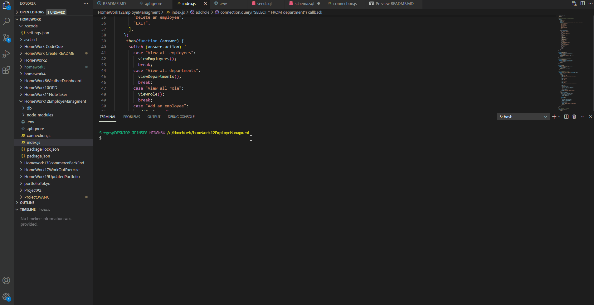

   <h1>Title Name: Employee Tracker </h1>

## Description :

Developers are often tasked with creating interfaces that make it easy for non-developers to view and interact with information stored in databases. Often these interfaces are known as **C**ontent **M**anagement **S**ystems. In this homework assignment, your challenge is to architect and build a solution for managing a company's employees using node, inquirer, and MySQL.

   <h3>## Content :

- [Description](#description)
- [Instruction](#instructions)
- [Usage](#usage)
- [Contributers](#contributers)
- [GitHub](#GitHub)
- [Email](#mail)
</h3>

## Instruction :

node index.js

## Usage :

MySQL , InquirerJS, console.table

## Contributers :

Sergey Ishimov

## GitHub : (https://github.com/Sergey-ddbug)

## Email : sishimov@gmail.com

